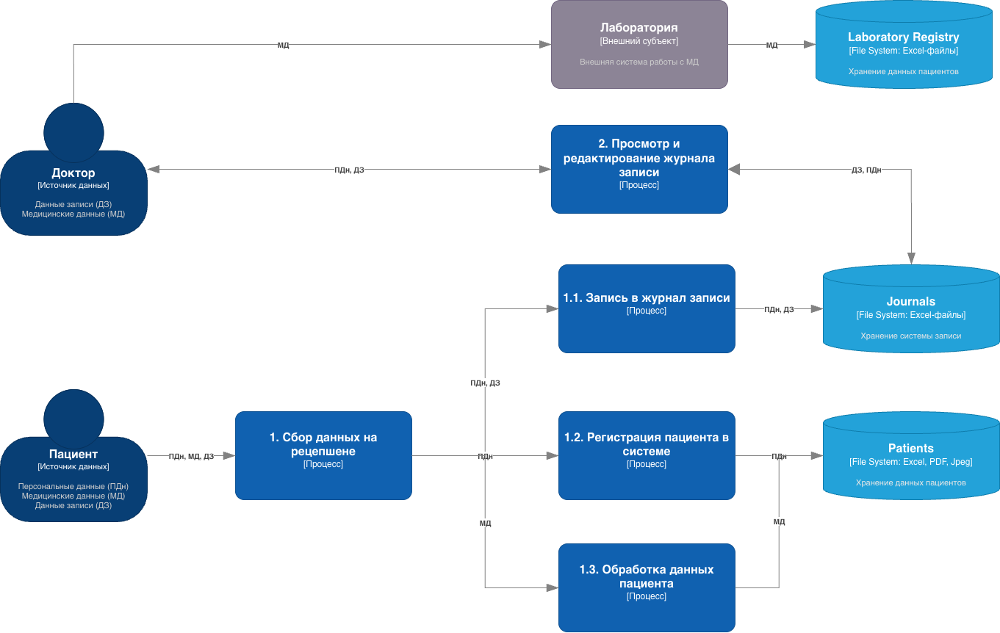

# Анализ безопасности системы

## AS IS 
В результате анализа компании были выявлены два основных бизнес-процесса:

- Работа с пациентом (запись, приёмы у докторов и т.д.)
- Работа с деньгами (приём платежей, кассиры, ТМЦ, бухгалтерия)

Так как работа с деньгами основана на промышленном проприетарным ПО (1С, ККМ, Exchange Mail и тд),
оперирует только финансовыми данными и почти не раскрывается в тексте задания, то её схема 
не представляет интереса.

### Работы с пациентами - диаграмма

На диаграмме ниже изображены источники данных, процессы, хранилища данных - и
потоки данных, которые их связывают.

## Аудит мер по обеспечению безопасности данных

| Требование                                                                             | Применение | Процесс / система                                                       | Проблемная зона                                                                                                                                                                                                                                   |
|----------------------------------------------------------------------------------------|------------|-------------------------------------------------------------------------|---------------------------------------------------------------------------------------------------------------------------------------------------------------------------------------------------------------------------------------------------|
| **152-ФЗ:** обработка ПДн на законной основе, фиксация целей и сроков хранения         | нет        | Ресепшен, медицинские специалисты; Excel, сканы на общем диске          | Согласия и основания обработки фиксируются вручную (контракты, формы); нет единой системы учёта целей/сроков по каждой записи данных; дубли в Excel и файлах усложняют соблюдение и удаление по запросу субъекта.                                 |
| **Медицинская тайна** (режим доступа к сведениям о здоровье)                           | нет        | Медкарты, анализы, приём; общий диск, Excel, JPG/PDF                    | Данные о здоровье хранятся рядом с прочими файлами; доступ к каталогам фактически определяется широкими правами на файловый сервер и отсутствием модели «need-to-know» на уровне записей.                                                         |
| **Минимизация ПДн** (Privacy by Design, Data Minimization)                             | нет        | Расширенная анкета пациента; дублирование в Excel и сканах              | Одни и те же атрибуты многократно копируются вручную в разные файлы и форматы; нет единого «источника истины» и политики сокращения копий.                                                                                                        |
| **Аудит действий** с конфиденциальными данными                                         | нет        | Все хранилища: файловый сервер, Excel, 1С (файловый режим), почта       | Результаты сохраняются и читаются без аудита; невозможно расследовать нетипичный доступ или утечку по следу операций.                                                                                                                             |
| **Разграничение доступа** к данным (RBAC/ABAC на объектах данных, не только вход в ПК) | нет        | Общий диск; Excel; интеграции 1С–ККМ                                    | Кроме доменной аутентификации ограничений на доступ к данным со стороны систем обработки нет; сотрудник с правами на каталог или файл видит все записи внутри.                                                                                    |
| **Контроль и прослеживаемость потоков данных** между ИТ-продуктами (Data Lineage)      | нет        | Excel ↔ файловый сервер ↔ Outlook; 1С ↔ ККМ                             | Внутренние потоки не контролируются технически; ограничения только организационные (бизнес-процесс), без журналов передачи и политик на уровне интеграций.                                                                                        |
| **Шифрование данных при хранении** (at rest) для носителей с ПДн/МД                    | нет        | Файловый сервер; рабочие ПК с Excel и сканами                           | Нет сведений о шифровании томов, каталогов или файлов с карточками/анализами; при компрометации носителя или копии данные читаются в открытом виде.                                                                                               |
| **Шифрование / защита каналов при передаче** (in transit) для ПДн и МД                 | нет        | LDAP/AD, TCP/IP к ККМ, Exchange; обмен файлами и вложениями             | Отдельные корпоративные сервисы могут использовать защищённые протоколы, но архитектурно не задано обязательное шифрование и контроль маршрутов для всех передач чувствительных данных (копии Excel, вложения, съёмные носители, внешние каналы). |
| **Целостность и актуальность** (контроль версий, единая запись)                        | нет        | Двойной учёт кассиров (Excel + 1С); несколько файлов на одного пациента | Расхождения между копиями; нет механизма согласованности и официальной «золотой» записи по пациенту и платежам.                                                                                                                                   |
| **Инциденты и реагирование** (обнаружение несанкционированного доступа, оповещения)    | нет        | Все системы                                                             | Сейчас нет описанных средств мониторинга доступа к файлам с ПДн и корреляции событий.                                                                                                                                                             |
| **Идентификация и аутентификация** сотрудников в корпоративной сети                    | да         | Active Directory на Windows Server; рабочие станции в домене            |                                                                                                                                                                                                                                                   |

## Улучшения работы с данными

| Тип данных                                                                                                      | Тег данных            | Способ защиты                                                                                                                                                                                                                                   |
|-----------------------------------------------------------------------------------------------------------------|-----------------------|-------------------------------------------------------------------------------------------------------------------------------------------------------------------------------------------------------------------------------------------------|
| **Идентификационные ПДн** ФИО, дата рождения, СНИЛС, паспортные/страховые реквизиты в анкетах, договорах и CRM  | `med:pii.identity`    | **Шифрование** полей/БД и всех каналов передачи (TDE/KMS, TLS). **Обезличивание** псевдонимы в аналитике и тестовых средах.                                                                                                                     |
| **Контактные данные** телефон, email для записи, напоминаний, ЛК                                                | `med:pii.contact`     | **Шифрование** полей, бэкапов и внешних интеграций. **Обфускация** частичное скрытие в интерфейсах и логах.                                                                                                                                     |
| **Демография и социальные сведения** адрес, место работы/учёбы из расширенной анкеты                            | `med:pii.demographic` | **Шифрование** хранения и передачи. **Обезличивание** в BI/ML-витринах (без прямой привязки к ФИО).                                                                                                                                             |
| **Медицинская карта, анамнез, назначения, заключения** Excel, сканы PDF/JPG на файловом сервере, будущая ЕМИС   | `med:phi.clinical`    | **Шифрование** файлов, БД и резервных копий. **Обезличивание** для исследований/статистики по регламенту. **Обфускация** только в служебных копиях для ролей без клинического доступа.                                                          |
| **Результаты анализов** выгрузки лаборатории, API, вложения                                                     | `med:phi.lab`         | **Шифрование** канала с лабораторией (mTLS/TLS) и хранения. **Обезличивание** агрегированные наборы для BI без связи с пациентом.                                                                                                               |
| **Платёжные и кассовые данные** суммы, способы оплаты, связь платежа с пациентом, интеграция ККМ–1С             | `med:fin.payment`     | **Шифрование** платёжных каналов и хранилищ. **Обфускация** токенизация/маскирование платёжных реквизитов.                                                                                                                                      |
| **Договоры и счета** сканы, PDF с персональными и суммовыми данными                                             | `med:fin.contract`    | **Шифрование** документов и доступа по ACL. **Обфускация** маскирование копий для внутренних ролей.                                                                                                                                             |
| **Учётные данные и секреты** пароли ЛК, refresh-токены, ключи API лаборатории, учётки интеграций                | `med:auth.secret`     | **Шифрование** хеширование паролей и хранение секретов в Vault/KMS. **Обфускация** маскирование в логах и запрет хранения секретов в Git.                                                                                                       |
| **Журналы аудита и операционные логи** кто открыл карту, экспорт, вход в ЛК                                     | `med:ops.audit`       | **Шифрование** неизменяемое хранение логов. **Обфускация** скрытие чувствительных параметров в логах.                                                                                                                                           |

> Доработайте диаграммы из предыдущего шага: отобразите на них, что следует использовать на каждом этапе потока.

Полноценное применение обозначенных практик в AS IS схеме - невозможно. Архитектуру нужно будет полностью переделать,
потому решение будет отображение при решении задания 2.