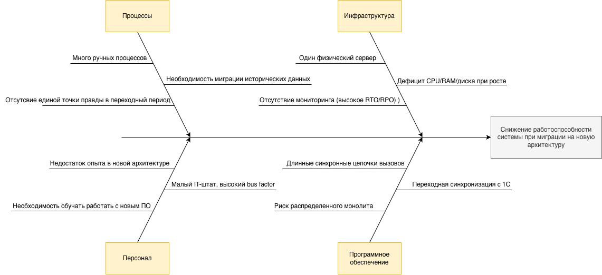

# Задание 4. Оценка узких мест при миграции

## Диаграмма Исикавы

## Список мер по устранению узких мест

### 1) Инфраструктура
- Перевести целевые компоненты в облачную инфраструктуру с авто-масштабированием (compute, managed database, object storage).
- Для пиковых сценариев использовать масштабирование по метрикам CPU/RAM/диска и по нагрузке на запросы.
- Настроить централизованный мониторинг и алертинг (доступность, время отклика, ошибки, утилизация ресурсов).

### 2) Программное обеспечение
- Внедрить ивентную модель взаимодействия между новыми компонентами, чтобы уменьшить жесткую связанность и зависимость от синхронных вызовов.
- Использовать паттерн Strangler Fig: постепенно выносить функции из legacy-контура в новые сервисы без "большого взрыва".
- На каждом шаге миграции фиксировать стабильность по ключевым метрикам и только после этого расширять зону нового контура.

### 3) Процессы
- Разбить миграцию на короткие итерации с четкими критериями "входа/выхода" для каждого этапа.
- Ввести обязательный pre-release checklist: проверка данных, тестов, мониторинга и готовности rollback-сценария.
- Проводить пост-релизный разбор каждого этапа (что сработало/что нет) и сразу обновлять регламенты.

### 4) Персонал
- Расширить команду новыми специалистами (DevOps/SRE, backend-инженеры, инженер по данным) под задачи миграции.
- Отправить действующих сотрудников на профильное обучение по облачной эксплуатации, event-driven подходу и observability.
- Каждую роль и зону ответственности делить между несколькими сотрудниками, чтобы снизить bus-фактор.